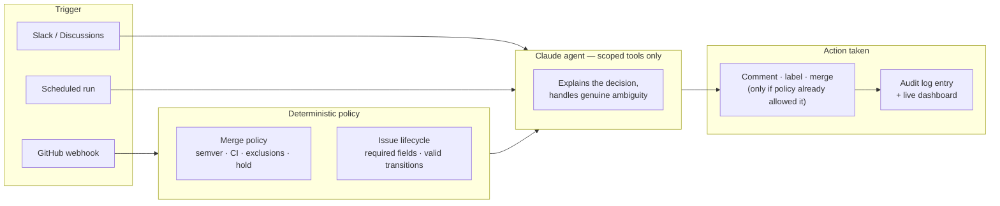
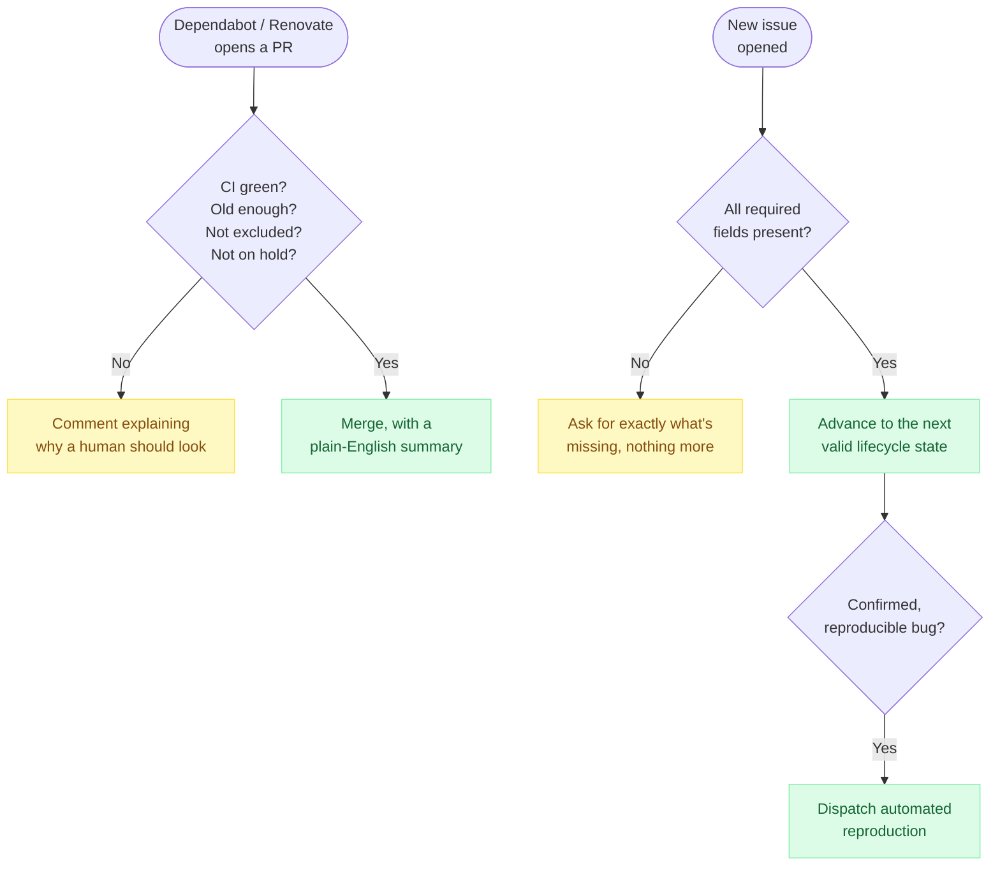

# kyctrl — an AI Maintainer Assistant for Kyverno

**Maintainer burnout, automated away — without giving up control.**

Open source projects drown in the same repetitive chores: dependency-bump
PRs that need reviewing, issues that arrive missing half the information
needed to act on them, contributors who need feedback nobody has time to
write. kyctrl is an autonomous assistant, built for
[Kyverno](https://kyverno.io), that takes that work off maintainers' plates
— and it doesn't just leave suggestions for a human to act on later. It
reasons about each situation, makes the call, and acts: commenting,
labeling, merging — the same things a human maintainer would do, logged
and reversible every time.

## Why it's different from "just wire up an LLM"

Most bot ideas fail the moment someone asks *"but what if it merges the
wrong thing?"* kyctrl answers that up front, by design:

- **Decisions are policy, not vibes.** Whether a PR is safe to auto-merge
  and which issue-triage step comes next are answered by plain,
  deterministic rules — a config file any maintainer can edit. The AI's job
  is never to decide; it's to explain the decision in plain English, and to
  handle the genuinely ambiguous cases a rulebook can't cover.
- **It can only do what it's explicitly allowed to do.** Each run gets a
  scoped set of capabilities — a triage run is never handed the merge
  button, a security run can never post publicly. There's no clever prompt
  to jailbreak, because the capability simply doesn't exist in that run.
- **Every action is a paper trail.** What happened, why, what it cost, and
  the exact command to undo it — all logged, all visible on a live
  dashboard.
- **Two independent kill switches.** One in a config file (reviewed via
  PR), one a live repository toggle (instant, no deploy). Either one stops
  everything.

## What's running today

**The core: it merges PRs and triages issues, for real.**

| | |
|---|---|
| 🔀 **Dependabot / Renovate auto-merge** | Parses the version bump, checks CI, checks it's not a security-sensitive package, checks it's not on hold — then either merges with an explanation or hands it to a human with a clear reason why. |
| 🏷️ **Issue triage** | Classifies incoming issues against Kyverno's real label taxonomy, asks for exactly the missing information (nothing more), and advances the issue through a defined lifecycle instead of leaving it stuck in a triage queue. |

**Also running alongside the core:**

| | |
|---|---|
| 🎓 **Contributor coaching** | Leaves encouraging, specific feedback on human-authored PRs — style, tests, conventions — never blocking, never merging. |
| 🔒 **Security triage** | Routes vulnerability reports straight to a private maintainer channel, completely isolated from public comment access. |
| 🧵 **Pattern detection** | Runs on a schedule, clusters the week's activity, and opens one tracking issue when the same kind of problem keeps recurring — instead of a maintainer noticing it the fourth time by hand. |
| 🧪 **Reproduction dispatch** | Hands a confirmed bug report straight to an automated cluster-based reproduction run. |
| 💬 **Docs Q&A** | Answers common questions in Slack and GitHub Discussions, grounded in the project's own docs, and escalates to a maintainer instead of guessing when it isn't confident. |

## How a request flows



## The two flagship workflows, side by side



## The safety rails, at a glance

| Guardrail | What it means in practice |
|---|---|
| Scoped tools per run | A triage run is never handed a merge tool. A security run can never post publicly. Nothing to jailbreak — the capability isn't there. |
| Config-driven policy | Merge rules, excluded packages, label taxonomy, rate limits — all in one editable file, live-loaded on every run. No redeploy to change behavior. |
| Two kill switches | A reviewed config change, or an instant one-click repository toggle. Either one halts everything immediately. |
| Full audit trail | Every action: what triggered it, what was decided, what it cost, how to reverse it — visible on a live dashboard. |
| Project knowledge as markdown | Kyverno-specific judgment (label meanings, safe-to-touch paths, dependency policy) lives in plain markdown skill files, not buried in code — any maintainer can improve it with a docs PR. |

## Growing beyond Kyverno

The Kyverno-specific knowledge is the only project-specific piece — it
lives entirely in editable markdown skill files. Any project can adopt the
same assistant by dropping in its own skill pack and policy config; the
agents, audit trail, and safety rails underneath don't change.

---

## Getting started

```bash
python3 -m venv .venv && source .venv/bin/activate
pip install -r requirements-dev.txt
cp .env.example .env   # fill in ANTHROPIC_API_KEY + either GITHUB_PAT (dev) or the App vars

python3 -m pytest tests/ -q          # offline, no network required

uvicorn src.main:app --reload --port 8000
# in another terminal, forward the repo's webhooks to localhost:
gh extension install cli/gh-webhook
gh webhook forward --repo=<owner>/<repo> --events=pull_request,issues,status \
  --url=http://127.0.0.1:8000/webhook --secret=<GITHUB_WEBHOOK_SECRET>
```

Open `http://127.0.0.1:8000/` for the dashboard.

Everything the agent does is governed by
[`.github/ai-maintainer.yaml`](.github/ai-maintainer.yaml) — per-workflow
enable/disable, merge policy, label taxonomy, rate limits, and safe
automation boundaries. Kyverno-specific judgment calls live in
[`skills/kyverno/`](skills/kyverno/), as plain markdown.

See `docs/planning/` for the fuller requirements and roadmap this
prototype is built against.
