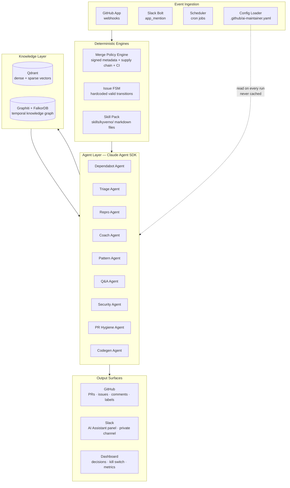
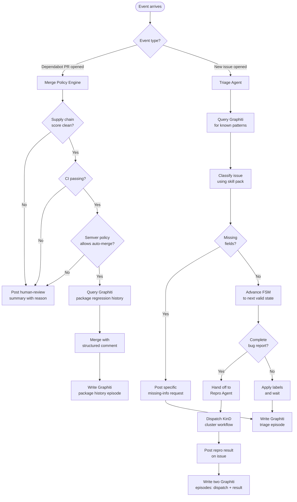
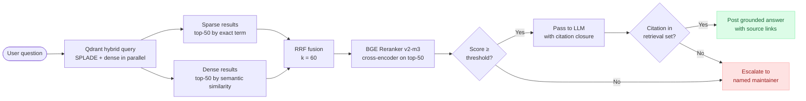
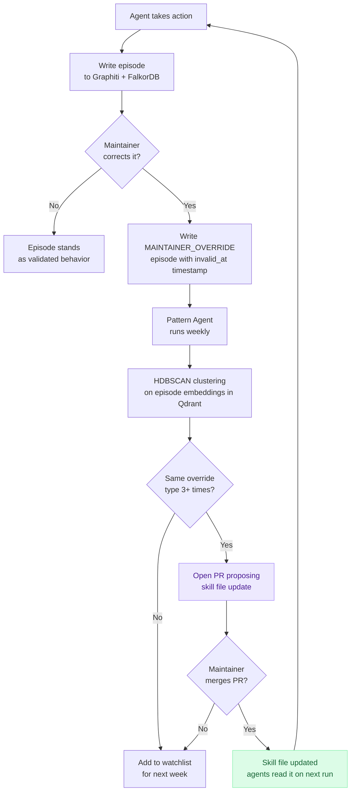

# kyctrl — Technical Architecture

**Version:** 2.0  
**Date:** August 2026  
**Status:** Design Document

---

## Overview

kyctrl is an autonomous AI maintainer assistant for Kyverno, built as a generalizable framework for the CNCF ecosystem. It reduces maintainer burnout by automating the zero-judgment repetitive work — Dependabot PRs, issue triage, bug reproduction, contributor coaching, Q&A — while keeping humans in control of every decision that actually requires judgment.

The core design principle is strict separation between deterministic engines (which make binary decisions) and LLMs (which write the communication around those decisions). An LLM never decides whether to merge a PR or which state an issue should transition to. Those decisions are made by code. The LLM explains what happened and why.

---

## 1. System Architecture

The system is organized into six layers. Each layer has a single responsibility and communicates downward only.

**Key architectural constraints:**

- Every agent has a scoped tool server. A triage agent cannot call merge. A security agent has no public comment tool. Capabilities are granted explicitly, not restricted by prompt.
- The config file is fetched live at the start of every agent run. Changing policy behavior never requires a code deployment.
- Branch protection at the GitHub level makes direct pushes to `main` physically impossible regardless of what agent code attempts.

---

## 2. Control Flow

This diagram shows the complete lifecycle from an incoming event to an output action. Two representative paths are shown: a Dependabot PR and a new issue.

---

## 3. RAG Query Pipeline

The Q&A Agent runs a three-stage retrieval pipeline before generating any answer. This diagram shows what happens between a user question and the final response.

**Two things enforced in code, not in a prompt:**

- The citation guard: a Python closure tracks every URL returned by retrieval in this run. `propose_answer()` rejects any citation whose URL was not in that set.
- The escalation gate: if the reranker returns nothing above the confidence threshold, the agent escalates unconditionally. It does not answer from general knowledge.

---

## 4. Temporal Memory and Self-Improvement

Graphiti stores every agent action as a timestamped episode. This is what enables the self-improvement cycle — the system gets better from maintainer corrections without any code changes.

**Why FalkorDB instead of Neo4j:** Graphiti requires a graph database for the temporal knowledge graph. FalkorDB is a drop-in replacement with zero API changes required — p99 latency of 140ms versus Neo4j's 46,923ms on equivalent workloads. The performance difference matters because multiple agents may query memory simultaneously during a GitHub event burst.

---

## 5. Agent Capability Map

Each agent has an explicitly scoped tool server. The table below shows what each agent can and cannot do. If a tool is not in the server, the agent cannot use it — this is enforced at the infrastructure level, not by prompt.

| Agent | Trigger | Can | Cannot |
|---|---|---|---|
| **Dependabot** | Dependabot/Renovate PR opened | Read CI status, merge PR, post comment, read Graphiti | Close issues, modify labels on issues |
| **Triage** | Issue opened | Apply labels, post comment, advance FSM, read/write Graphiti | Merge PRs, close issues without FSM transition |
| **Repro** | Triage handoff | Dispatch workflow, post issue comment, write Graphiti episode | Merge PRs, apply labels |
| **PR Hygiene** | Push to main + schedule | Rebase PR, re-trigger CI, post comment, write Graphiti episode | Merge PRs, close issues |
| **Coach** | Human PR opened | Post PR comment, read Graphiti contributor history, write Graphiti episode | Merge, approve, close |
| **Security** | `security` label applied | Read issue, post to private Slack channel, read CVE data | Post any public comment, close issue, apply labels |
| **Pattern** | Weekly schedule | Read Graphiti, run HDBSCAN, file tracking issue, open skill file PR | Merge PRs, post issue comments |
| **Q&A** | Slack mention, Discussions comment | Query Qdrant, read Graphiti, post Slack stream, post Discussions reply | Any GitHub write operations |
| **Codegen** | PR touching `api/` | Run `make codegen`, post PR comment with diff | Merge PRs, close issues |

---

## 6. Technology Stack

| Layer | Component | Choice | Why |
|---|---|---|---|
| **Agent runtime** | LLM | Claude Sonnet (claude-agent-sdk) | Best-in-class instruction following for structured tool use |
| **Vector store** | Qdrant 1.17 | Dense + sparse (SPLADE) + ColBERT in one system | CNCF-donated, Rust, native RRF fusion, best free tier, no LLM at index time |
| **Sparse retrieval** | SPLADE via FastEmbed | Lexical precision for exact identifiers | Catches `ClusterPolicy`, `kyverno.io/v1`, CEL function names — terms dense search misses |
| **Dense retrieval** | voyage-code-2 | Best embedding model for code-heavy technical docs | Run async batched — rate limits eliminated |
| **Reranker** | BGE Reranker v2-m3 | Cross-encoder scoring on fused top-50 | Self-hostable, no per-query API cost, score-threshold gating |
| **Temporal memory** | Graphiti | Episode-based temporal knowledge graph | 63.8% LongMemEval temporal recall vs 49% for Mem0 |
| **Graph database** | FalkorDB | Drop-in Neo4j replacement for Graphiti | p99 140ms vs Neo4j 46,923ms, zero API changes required |
| **Web crawling** | Crawl4AI | kyverno.io + resolved issues, nightly refresh | No LLM calls at index time |
| **Clustering** | HDBSCAN | Pattern Agent weekly clustering | Runs directly on Qdrant episode embeddings, no intermediate graph |
| **Supply chain** | Socket.dev GitHub App | 70+ behavioral risk signals per package | Stamps labels the Merge Policy Engine reads — deterministic |
| **Slack** | Slack Bolt AI Assistant | Streaming in native AI panel | Correct surface — streaming, dedicated panel, suggested prompts |

---

## 7. Safety and Configuration

### Kill switches

Two independent kill switches exist at different granularities:

- **Global:** Set the `AI_MAINTAINER_ENABLED` repository variable to `false`. All agent activity stops on the next triggered event. Toggleable from the dashboard in one click.
- **Per-workflow:** Set `enabled: false` for any specific workflow in `.github/ai-maintainer.yaml`. The remaining workflows continue unaffected.

### Config-driven behavior

Every policy decision is controlled by `.github/ai-maintainer.yaml`, fetched live at the start of every agent run. This includes: which semver bump types auto-merge, which packages are excluded from auto-merge, how many idle days trigger a hygiene nudge, what the missing-info template says. Changing agent behavior requires editing one YAML file — no Python, no deployment.

### Branch protection

Branch protection at the GitHub level prevents direct pushes to `main` and all release branches regardless of what the agent code attempts. This is not a prompt instruction — it is a GitHub setting enforced by the platform.

### Audit trail

Every agent action is written to the audit log with: what triggered it, what the agent concluded, what action was taken, and how to reverse it. The dashboard surfaces this per-entry. Maintainer corrections (label removal, revert, comment edit) are detected automatically and written as `MAINTAINER_OVERRIDE` episodes to Graphiti, feeding the self-improvement cycle.

---

## 8. CNCF Generalisation

The Kyverno-specific intelligence lives entirely in the skill pack (`skills/kyverno/`). These are markdown files — any maintainer can improve them with a pull request, no Python required.

Any CNCF project adopts the full framework by:

1. Installing the kyctrl GitHub App
2. Adding `.github/ai-maintainer.yaml` with project-specific policy
3. Contributing a skill pack directory (`skills/<project>/`) with their triage taxonomy, label definitions, codegen paths, and bug report template

The agents, RAG pipeline, Graphiti memory, and self-improvement cycle run unchanged. The skill pack is the only project-specific artifact.